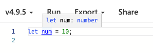
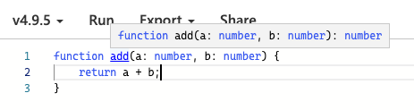
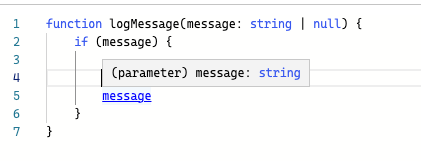
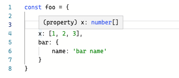
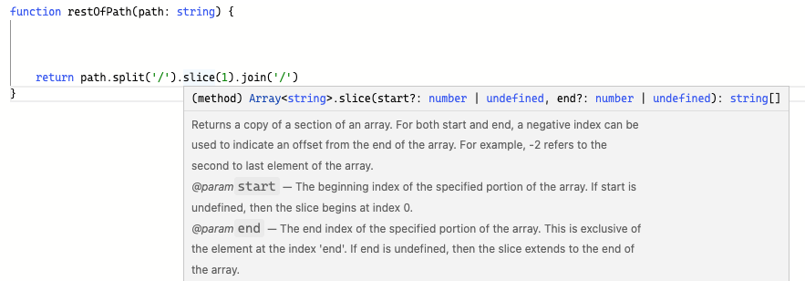

## 편집기를 사용하여 타입 시스템 탐색하기

타입스크립트는 타입스크립트 컴파일러(tsc)를 실행하는 것이 주된 목적이지만, 타입스크립트 서버 또한 ‘언어 서비스’를 제공한다는 점에서 중요합니다. 여기서 언어서비스란 코드 자동완성, 명세 검사, 검색, 리팩터링이 포함됩니다.

보통은 편집기를 통해서 이러한 언어 서비스를 사용할 수 있습니다.

### 1. 변수 타입 추론

가장 쉬운 예시로 변수 위에 마우스 커서를 올려보면 타입스크립트가 해당 변수를 어떤 타입으로 판단하고 있는지 확인할 수 있습니다.



### 2. 함수 타입 추론

함수의 타입도 마찬가지로 타입스크립트가 타입 추론한 것을 볼 수 있습니다.



### 3. 분기에서의 타입 추론

특정 시점에 타입스크립트가 값의 타입을 어떻게 이해하고 있는지 살펴볼 수 있습니다.



### 4. 객체에서의 타입 추론

객체에서는 개별 속성을 살펴봄으로써 타입스크립트가 어떻게 각각의 속성을 추론하는지 살펴볼 수 있습니다. 만약 내가 원하는 타입이 number[]가 아니라 [number, number, number] 였다면 직접 명시해야 합니다.



### 5. 메서드 체인에서의 타입 추론

연산자 체인 중간의 추론된 제너릭 타입을 알고 싶다면 메서드 이름을 조사하면 됩니다. `Array<string>`은 split 결과의 타입이 string 이라고 추론되었음을 의미합니다.



### 6. 편집기 오류를 통한 타입 추론

편집기상의 타입 오류를 살펴보는 것도 타입 시스템의 성향을 파악하는데 좋은 방법입니다. 다음 코드를 볼까요? 타입스크립트는 두 곳에서 에러를 발생시켰습니다. 왜일까요?

자바스크립트에서 typeof null은 object 이므로, 첫번째 if 문에서 여전히 null 일 가능성이 있습니다. 두번째 오류는 document.getElementById가 null을 반환할 가능성이 있기 때문에 그렇습니다.

```tsx
function getElement(elOrId: string | HTMLElement | null): HTMLElement {
  if (typeof elOrId === "object") {
    return elOrId; // Type 'HTMLElement | null' is not assignable to type 'HTMLElement'. Type 'null' is not assignable to type 'HTMLElement'.(2322)
  } else if (elOrId === null) {
    return document.body;
  } else {
    const el = document.getElementById(elOrId);
    return el; // Type 'HTMLElement | null' is not assignable to type 'HTMLElement'. Type 'null' is not assignable to type 'HTMLElement'.(2322)
  }
}
```

### 7. Go to Definition을 통한 타입 추론

코드 내에 fetch 가 있다고 가정해봅시다. 이 함수를 더 알아보길 원한다염 'Go to Definition' 옵션을 통해 타입스크립트에 포함되어 있는 DOM 타입 선언인 lib.dom.d.ts로 이동해서 확인할 수 있습니다.

fetch는 Promise를 반환하고 두 개의 매개변수를 받는 것을 알 수 있습니다.

```tsx
declare function fetch(
  input: RequestInfo | URL,
  init?: RequestInit
): Promise<Response>;
```

RequestInit를 클릭하면 fetch에 들어가는 다양한 option을 볼 수 있습니다. body, header 등 Request를 생성할 때 사용할 수 있는 모든 옵션이 있습니다.

```tsx
interface RequestInit {
    /** A BodyInit object or null to set request's body. */
    body?: BodyInit | null;
    /** A string indicating how the request will interact with the browser's cache to set request's cache. */
    cache?: RequestCache;
    /** A string indicating whether credentials will be sent with the request always, never, or only when sent to a same-origin URL. Sets request's credentials. */
    credentials?: RequestCredentials;
        /** A Headers object, an object literal, or an array of two-item arrays to set request's headers. */
    headers?: HeadersInit;

    ...
```

이처럼 해당 라이브러리를 어떻게 사용하면 되는지, 어떻게 모델링 되었는지 파악할 수 있고 잘못 사용했을 때 적절한 오류를 발생시키면서 사전에 적절한 코드를 작성할 수 있게 됩니다.

### 마치면서

이번 시간에는 다소 간단하지만 타입스크립트를 사용하는 이유라고 할 수 있는 편집기에서 타입 추론 결과를 보는 법에 대해 배워봤습니다. 정말 유용하기 때문에 이것 때문이라도 타입스크립트는 쓰는게 맞다고 생각합니다.
